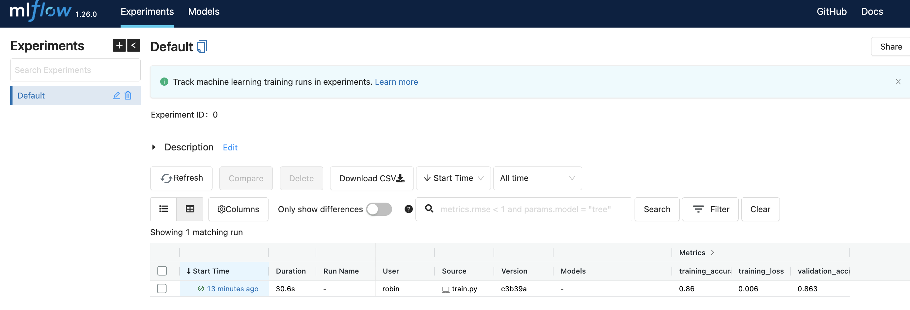

# Fashion MNIST model with MLflow
This project shows how to train a Fashion MNIST model with MLflow for tracking and model representation.

<p align="center">

</p>

## Workflow

Install and activate the conda environment by executing the following commands:
```
conda env create -f environment.yml
conda activate aml_command_sdk
```

Run mlflow: [http://0.0.0.0:5000/](http://0.0.0.0:5000/)
```
# mlflow ui
mlflow server --backend-store-uri sqlite:///mlflow.db --default-artifact-root ./mlruns --host 0.0.0.0  # run with db
```

Train:
```
python aml_command_sdk/src/train.py
```

Make a local prediction using the trained mlflow model. You can use either csv or json files:
```
cd aml_command_sdk
mlflow models predict --model-uri "model" --input-path "test_data/images.csv" --content-type csv --env-manager local
# mlflow models predict --model-uri "model" --input-path "test_data/images.json" --content-type json --env-manager local
```

Output
```json
[{"0": -2.0759499073028564, "1": -4.7272443771362305, "2": -3.398890495300293, "3": -1.2607831954956055, "4": -3.444779396057129, "5": 5.748242378234863, "6": -2.530381441116333, "7": 6.370605945587158, "8": 2.538969039916992, "9": 7.854280948638916}, {"0": 4.441205024719238, "1": -3.6761248111724854, "2": 11.795886039733887, "3": 0.3185560405254364, "4": 6.609316825866699, "5": -6.741459369659424, "6": 7.912017345428467}]
```

## Issue 1
In MLflow I got an error:
```
INVALID_PARAMETER_VALUE: Model registry functionality is unavailable; got unsupported URI './mlruns' for model registry data storage. Supported URI schemes are: ['postgresql', 'mysql', 'sqlite', 'mssql']. See https://www.mlflow.org/docs/latest/tracking.html#storage for how to run an MLflow server against one of the supported backend storage locations.
```
[Solution](https://stackoverflow.com/questions/63255631/mlflow-invalid-parameter-value-unsupported-uri-mlruns-for-model-registry-s) = run with a db, also register location of models:

```bash
mlflow server --backend-store-uri sqlite:///mlflow.db --default-artifact-root ./mlruns --host 0.0.0.0 
```
## Issue 2
The trained model does not display in MLflow


## Blog post
To learn more about the code in this repo, check out the accompanying blog post: https://bea.stollnitz.com/blog/aml-command/